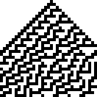

# Hackvent 2019

01. [`HV19{just-4-PREview!}`](#day-1)
02. [`HV19{Cr4ck_Th3_B411!}`](#day-2)
03. [`HV19{h01d-th3-d00r-4204-ld4Y}`](#day-3)
04. [`HV19{R3memb3r, rem3mber - the 24th 0f December}`](#day-4)
05. [`HV19{D1fficult_to_g3t_a_SPT_R3ader}`](#day-5)
06. [`HV19{BACONCIPHERISSIMPLEBUTCOOL}`](#day-6)
07. [`HV19{1m_als0_w0rk1ng_0n_a_r3m0t3_c0ntr0l}`](#day-7)
08. [`HV19{5M113-420H4-KK3A1-19801}`](#day-8)
09. [`HV19{Cha0tic_yet-0rdered}`](#day-9)
10. [`HV19{Sh3ll_0bfuscat10n_1s_fut1l3}`](#day-10)
11. [`HV19{th3_cha1n_1s_0nly_as_str0ng_as_th3_w3ak3st_l1nk}`](#day-11)

- h1. [`HV19{1stHiddenFound}`](#hidden-1)
- h2. [`HV19{Dont_confuse_0_and_O}`](#hidden-2)

## Day 1

> I got this little image, but it looks like the best part got censored on the
> way. Even the tiny preview icon looks clearer than this! Maybe they missed
> something that would let you restore the original content?


There is an another image inside from 332th byte. 

## Day 2

> Today we give away decorations for your Christmas tree. But be careful and do not break it.

The [Triangulation.stl](02/Triangulation.stl) is stereolithography format for 3D model.
There is a QR code in the middle of the ball.


## Day 3

I used https://tio.run/#hodor to interpret the [script](03/script.hd).

## Day 4

> Santa released a new password policy (more than 40 characters, upper, lower,
> digit, special).
>
> The elves can't remember such long passwords, so they found a way to continue to
> use their old (bad) password:
>
> merry christmas geeks

Run windows, install [AutoHotKey](https://www.autohotkey.com/), run the script [HV19-PPC.ahk](04/HV19-PPC.ahk), open notepad, write slowly `merry christmas geeks` and it will be replaced with the flag.

## Day 5

> To handle the huge load of parcels Santa introduced this year a parcel tracking
> system. He didn't like the black and white barcode, so he invented a more
> solemn barcode. Unfortunately the common barcode readers can't read it anymore,
> it only works with the pimped models santa owns. Can you read the barcode


I wrote small [program](05/dump.c) to dump hex colors from the first line of the image and processed it with following pipeline
```sh
< 157de28f-2190-4c6d-a1dc-02ce9e385b5c.png png2ff | ./dump | uniq | grep -vF 'ffff ffff' | cut -c11-12 | h2b
```
The flag is in the middle of other letters.
```
X8YIOF0ZP4S8HV19{D1fficult_to_g3t_a_SPT_R3ader}S1090OMZE0E3NFP6E
            ^^^^^^^^^^^^^^^^^^^^^^^^^^^^^^^^^^^
```

## Day 6

> *F*ra*n*cis Baco*n* *w*a*s* *a*n E*ng*lish ph*i*l*os*o*p*her a*n*d *s*tat*e*sm*a*n w*h*o se*rve*d *a*s At*t*or*n*ey Gen*e*ral and as *L*or*d* *Ch*an*ce*l*l*or of *En*g*l*an*d*. Hi*s* *w*orks ar*e* c*red*it*e*d w*ith* d*e*ve*lo*pi*ng* *t*h*e* sci*e*nt*i*fic me*t*hod and re*m*ai*ned* in*fl*u*en*ti*al* th*rou*gh *t*he s*cien*tific *r*ev*o*l*u*ti*o*n.
> *B*a*co*n h*as* *b*e*e*n ca*l*led *th*e *f*ath*e*r o*f* emp*iric*i*s*m. *Hi*s *wor*ks ar*g*ued for th*e* po*ssi*bi*li*t*y* of s*c*ie*n*tifi*c* *kno*wl*edg*e b*a*se*d* onl*y* u*p*on i*n*du*c*t*i*ve *r*ea*s*onin*g* *a*nd c*aref*u*l* o*bs*er*v*ation o*f* *e*v*e*nt*s* in *na*tur*e*. Mo*st* *i*mp*ort*an*t*l*y*, *he* a*rgue*d sc*i*en*c*e co*uld* *b*e *a*c*hi*eved by us*e* of a *s*ce*p*t*ical* a*nd* me*t*hod*i*ca*l* *a*pp*roa*ch wh*er*eby *s*cientist*s* ai*m* t*o* avo*i*d m*i*sl*ead*in*g* themsel*ve*s. *A*lth*oug*h *h*is *p*ra*c*tic*a*l i*d*e*a*s ab*out* *s*u*ch* *a* *m*et*h*od, *t*he B*a*con*i*an meth*o*d, d*i*d no*t* have *a* l*o*n*g*-*la*s*t*ing *i*nfluen*c*e, *th*e *g*e*ne*ral *i*dea *of* *t*he imp*o*rta*n*ce and pos*s*i*b*il*it*y o*f* a s*c*ept*i*cal methodology makes Bacon the father of the scientific method. This method was a new rhetorical and theoretical framework for science, the practical details of which are still central in debates about science and methodology.

This is [the Baconian cipher](http://www.wondersandmarvels.com/2012/12/shakespeares-secrets-a-hidden-cipher-in-literatures-greatest-works.html).
The original cypher text is in file [`text.html`](06/text.html). I wrote a small lex/yacc parser (see [`decode_lex.py`](06/decode_lex.py) and [`decode.py`](06/decode.py)) to transfer it to binary representation and [`solve.py`](06/solve.py) decrypts the cipher.

```
SANTALIKESHISBACONBUTALSOTHISBACONTHEPASSWORDISHVXBACONCIPHERISSIMPLEBUTCOOLXREPLACEXWITHBRACKETSANDUSEUPPERCASE
```
With extra spaces:
```
SANTA LIKES HIS BACON BUT ALSO THIS BACON THE PASSWORD IS HV X BACON CIPHER IS SIMPLE BUT COOL X REPLACE X WITH BRACKETS AND USE UPPERCASE
```

## Day 7

The [video](07/3DULK2N7DcpXFg8qGo9Z9qEQqvaEDpUCBB1v.mp4) with 8 blinking LEDs represents byte stream.
After conversion to png
```sh
ffmpeg -i 3DULK2N7DcpXFg8qGo9Z9qEQqvaEDpUCBB1v.mp4 out%04d.png
```
and a lot of manual work we got the flag.
The final solution is generated by [this](07/solve.py) simple python script.

## Day 8

> Introduction
>
> You hacked into the system of very-secure-shopping.com and you found a
> [SQL-Dump](08/dump.sql) with $$-creditcards numbers. As a good hacker you inform the company
> from which you got the dump. The managers tell you that they don't worry,
> because the data is encrypted.
>
> Goal
>
> Analyze the "Encryption"-method and try to decrypt the flag.
>
> Hints
>
> - CC-Numbers are real/valid ones.
> - Cyber-Managers often doesn't know the difference between encoding and encryption.

When I saw the [dump](08/dump.sql), I noticed the sequence for **Severus Snape**: `:)RPQRSTUVWXYZ[\]^`.
Credit cards use [Luhn algorithm](https://en.wikipedia.org/wiki/Luhn_algorithm) for validation and I decided to search valid number for following pattern `*111111111111111` (Actually I searched lots of them, but this one was the correct one) and found `4111111111111111`.
I did following calculations
```python
ord('R') - 4 = 78
ord('P') - 1 = 79
ord('Q') - 1 = 80
ord('R') - 1 = 81
ord('S') - 1 = 82
```
that lead me to a following algorithm.
```python
s = 'RPQRSTUVWXYZ[\]^'
o = ''
for i in range(len(s)):
	o += str(ord(s[i]) - 78 - i)
```
It works for all credit card numbers, but it does not generate correct flag.
Well, here I have to thank you to @MartinDrab because he helped me to realize that I am searching index to the ascii table.
```python
def decode(s):
    s = s[2:]
    o = ''
    for i in range(len(s)):
        o += chr(ord(s[i]) - 30 - i)
    return o
```
Complete script is [here](08/solve.py).

## Day 9

> ### Santas Quick Response 3.0
>
> Visiting the following railway station has left lasting memories.
>
> 
>
> Santas brand new gifts distribution system is heavily inspired by it. Here is
> your personal gift, can you extract the destination path of it?
>
> 
>
> Hints
> - it starts with a single pixel
> - centering is hard

I found [this article](https://www.wikiwand.com/en/Rule_30) when searching the railway image which describes [Rule 30](https://en.wikipedia.org/wiki/Rule_30).
It is necessary to generate mask with Rule 30 (I wrote [this](09/solve.py) python script) and `xor` it with broken QR code.

 `XOR`  `=` 

## Day 10

> ### Guess what
>
> The flag is right, of course

TL;DR: Run the `guess` binary and look to the `/proc/<PID>/cmdline`.

The binary constructs environment variable based on the PID of the process and re-execs itself via bash.
In the second exec it detects the variable, deciphers the shell scripts and execs it.

```sh
#!/bin/bash

read -p "Your input: " input

if [ $input = "HV19{Sh3ll_0bfuscat10n_1s_fut1l3}" ]
then
  echo "success"
else
  echo "nooooh. try harder!"
fi
```

## Day 11

> ### Frolicsome Santa Jokes API
>
> The elves created an API where you get random jokes about santa.
>
> Go and try it here: http://whale.hacking-lab.com:10101

API encodes information to the `token`.
This [script](11/solve.sh) access platinum part with the flag.

## Hidden 1

The first hidden flag is hidden in copy to clipboard of the [Day 6](#day-6).

```
Born: January 22	     	 	   	   	 	       	     	  	  
Died: April 9   	  	 	    	  	      	   		  	  
Mother: Lady Anne   		 	   	   	      	  	      	  
Father: Sir Nicholas	 	      		    	    	  	  	      	      
Secrets: unknown      	 	  	 	    	    	   	       	  
```
The spaces behind text are spaces, tabs and newlines hiding the flag in the message vie `stegsnow` command.
```sh
python decode.py > msg
stegsnow -C msg
```

## Hidden 2

The video name `3DULK2N7DcpXFg8qGo9Z9qEQqvaEDpUCBB1v.mp4` from [Day 7](#day-7) encodes hidden flag with [Base 58](https://en.wikipedia.org/wiki/Base58).

## notes

- https://ranking.academy.hacking-lab.com/
- https://hv19.idocker.hacking-lab.com/
